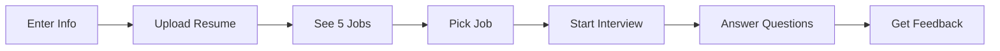

# PROJECT_REQUIREMENTS.md - AI Interview Platform

## Project Overview
**Project Name**: Ipsago AI - Mock Interview Platform  
**Timeline**: 15 hours (Hard deadline)  
**Team**: 3 developers (1 Frontend, 2 Backend)  
**Stack**: Next.js 14, TypeScript, Turborepo, Prisma, Supabase, OpenAI, AssemblyAI

## CRITICAL CONSTRAINTS
- **NO AUTHENTICATION**: Use localStorage for user tracking
- **MVP ONLY**: Core features only, no nice-to-haves
- **15 HOUR DEADLINE**: Prioritize working code over perfect code
- **NO LOGIN/SIGNUP**: Simple user form (name, email, age) → immediate access

## 📁 PROJECT STRUCTURE

```
ipsago-ai/
├── apps/
│   ├── web/                    # Next.js application
│   │   ├── app/               # App router pages
│   │   │   ├── page.tsx       # Landing (user form)
│   │   │   ├── upload/        # Resume upload
│   │   │   ├── jobs/          # Job recommendations
│   │   │   ├── interview/     # Interview session
│   │   │   ├── feedback/      # Results
│   │   │   └── api/           # API routes
│   │   ├── components/        # React components
│   │   ├── lib/              # Utilities
│   │   └── hooks/            # Custom hooks
│   └── docs/                  # (ignore - came with template)
├── packages/
│   ├── database/              # Prisma + Supabase
│   ├── ai/                    # OpenAI + AssemblyAI
│   ├── ui/                    # Shared UI components
│   └── typescript-config/     # TS configuration
└── turbo.json                 # Turborepo config
```

## 🔄 USER FLOW (SIMPLIFIED)



## 📝 CORE FEATURES ONLY

### MUST HAVE (Priority 1)
1. ✅ User info collection (name, email, age)
2. ✅ Resume upload & parsing to markdown
3. ✅ Show 5 job recommendations
4. ✅ Generate 10 interview questions
5. ✅ Speech-to-text for answers
6. ✅ Basic feedback generation

### DO NOT BUILD (Save Time)
- ❌ Authentication/Login
- ❌ User profiles
- ❌ Video recording
- ❌ Email notifications
- ❌ Admin panel
- ❌ Analytics
- ❌ Payment
- ❌ Social features

## 💻 CODE RULES FOR AI ASSISTANTS

### GENERAL RULES
1. **NO PERFECTIONISM**: Working > Perfect
2. **NO COMPLEX PATTERNS**: Simple > Clever
3. **NO AUTHENTICATION**: Use localStorage only
4. **USE EXISTING PACKAGES**: Don't reinvent
5. **MOCK IF BLOCKED**: Use fake data if API fails

### FRONTEND RULES
```typescript
// DO: Simple, direct components
export default function JobCard({ job }) {
  return <div onClick={() => selectJob(job.id)}>{job.title}</div>
}

// DON'T: Over-engineered abstractions
// No complex HOCs, render props, or compound components
```

### API RULES
```typescript
// DO: Simple API routes
export async function POST(req: Request) {
  const data = await req.json()
  const result = await prisma.user.create({ data })
  return Response.json(result)
}

// DON'T: Complex middleware, auth checks, rate limiting
```

### DATABASE RULES
```typescript
// DO: Simple Prisma queries
const user = await prisma.user.create({
  data: { email, fullName, age }
})

// DON'T: Complex transactions, RLS, triggers
```

### AI INTEGRATION RULES
```typescript
// DO: Simple OpenAI calls with fallbacks
try {
  const response = await openai.completions.create({...})
} catch {
  return FALLBACK_QUESTIONS 
}

// DON'T: Complex prompt engineering, fine-tuning
```

## 🚀 QUICK START SNIPPETS

### 1. User Creation (No Auth)
```typescript
// app/api/users/route.ts
import { prisma } from '@/packages/database'

export async function POST(req: Request) {
  const { email, fullName, age } = await req.json()
  
  const user = await prisma.user.create({
    data: { email, fullName, age }
  })
  
  return Response.json({ userId: user.id })
}
```

### 2. Resume Upload
```typescript
// app/api/resume/upload/route.ts
export async function POST(req: Request) {
  const formData = await req.formData()
  const file = formData.get('file') as File
  const userId = formData.get('userId') as string
  
  // Parse resume (simplified)
  const text = await file.text()
  const markdown = convertToMarkdown(text)
  
  await prisma.user.update({
    where: { id: userId },
    data: { resumeMarkdown: markdown }
  })
  
  return Response.json({ success: true })
}
```

### 3. Job Matching
```typescript
// app/api/jobs/match/route.ts
export async function POST(req: Request) {
  const { userId } = await req.json()
  
  // Simple matching: just return 5 random jobs
  const jobs = await prisma.jobDescription.findMany({
    take: 5,
    orderBy: { createdAt: 'desc' }
  })
  
  return Response.json(jobs)
}
```

### 4. Generate Questions
```typescript
// app/api/interview/questions/route.ts
const FALLBACK_QUESTIONS = [
  "Tell me about yourself",
  "Why this position?",
  // ... 10 questions
]

export async function POST(req: Request) {
  const { jobId, userId } = await req.json()
  
  try {
    const completion = await openai.chat.completions.create({
      model: "gpt-3.5-turbo",
      messages: [{
        role: "system",
        content: `Generate 10 interview questions for ${jobTitle}`
      }]
    })
    
    return Response.json(completion.choices[0].message)
  } catch {
    return Response.json({ questions: FALLBACK_QUESTIONS })
  }
}
```

### 5. Speech to Text
```typescript
// app/api/interview/transcribe/route.ts
export async function POST(req: Request) {
  const { audioData } = await req.json()
  
  // Use browser's Web Speech API as fallback
  // Or AssemblyAI if setup
  
  return Response.json({ transcript: "User's answer here" })
}
```

## 📋 TASK DIVISION

### Developer 1 (Frontend)
```
Hour 1-3: Setup + Landing page with user form
Hour 4-6: Resume upload page + job cards display  
Hour 7-9: Interview UI with question display
Hour 10-12: Audio recording + transcript display
Hour 13-15: Feedback page + polish
```

### Developer 2 (Backend - AI)
```
Hour 1-3: OpenAI integration + question generation
Hour 4-6: Resume parsing logic
Hour 7-9: AssemblyAI setup + STT
Hour 10-12: Feedback generation
Hour 13-15: Integration + testing
```

### Developer 3 (Backend - Database)
```
Hour 1-3: Database setup + seed 100 jobs
Hour 4-6: Job matching algorithm
Hour 7-9: Session management
Hour 10-12: Data persistence
Hour 13-15: API optimization
```

## 🚨 FALLBACK STRATEGIES

### If OpenAI fails:
```typescript
const PREDEFINED_QUESTIONS = {
  developer: ["What's your experience with React?", ...],
  designer: ["Show me your portfolio", ...],
  analyst: ["How do you handle data?", ...]
}
```

### If AssemblyAI fails:
```typescript
// Use browser's Web Speech API
const recognition = new webkitSpeechRecognition()
```

### If Resume parsing fails:
```typescript
// Manual input form
<form>
  <input name="skills" placeholder="Enter skills (comma separated)" />
  <textarea name="experience" placeholder="Paste experience" />
</form>
```

### If Job matching fails:
```typescript
// Return first 5 jobs from same department
const jobs = await prisma.jobDescription.findMany({
  where: { department: userDepartment },
  take: 5
})
```

## ⚡ ENVIRONMENT VARIABLES

```env
# Required (minimal)
DATABASE_URL=postgresql://...
OPENAI_API_KEY=sk-...

# Optional (can work without)
ASSEMBLY_AI_KEY=...
UPLOADTHING_SECRET=...
```

## 🎯 SUCCESS METRICS

1. User can complete full flow in < 5 clicks
2. Interview starts within 30 seconds of landing
3. Basic feedback generated
4. No login required
5. Works on Chrome (don't worry about other browsers)

## ❌ COMMON PITFALLS TO AVOID

1. **DON'T** spend time on auth
2. **DON'T** optimize prematurely  
3. **DON'T** build admin features
4. **DON'T** implement complex error handling
5. **DON'T** write tests
6. **DON'T** setup CI/CD
7. **DON'T** worry about mobile responsive (desktop only is fine)
8. **DON'T** implement rate limiting
9. **DON'T** add animations/transitions
10. **DON'T** build data validation beyond basic

## ✅ DEFINITION OF DONE

- [ ] User enters name, email, age (no auth)
- [ ] Resume uploads and shows markdown
- [ ] 5 jobs display
- [ ] User selects job
- [ ] 10 questions show
- [ ] User can speak answers
- [ ] Transcript displays
- [ ] Basic feedback shows
- [ ] Deployed to Vercel

## 💡 PROMPTS FOR AI CODING ASSISTANTS

When asking AI for help, use these templates:

### For Features:
"Create a simple [feature] for the interview platform. No auth needed, use localStorage for userId. Make it work quickly without complex patterns."

### For Bugs:
"Fix this error quickly. If the proper solution takes too long, give me a workaround or mock data approach."

### For UI:
"Create a basic [component] using Tailwind. No animations, no complex state. Just make it functional."

### For API:
"Create a Next.js API route that [does X]. No middleware, no auth checks, just basic functionality with simple error handling."

## 📱 CONTACT & SYNC

- Every 3 hours: Quick sync on progress
- Use comments in code for TODOs
- If blocked > 15 mins: Use mock data and move on
- Final hour: Focus on deployment only

---

**REMEMBER**: Perfect is the enemy of done. Ship it! 🚀